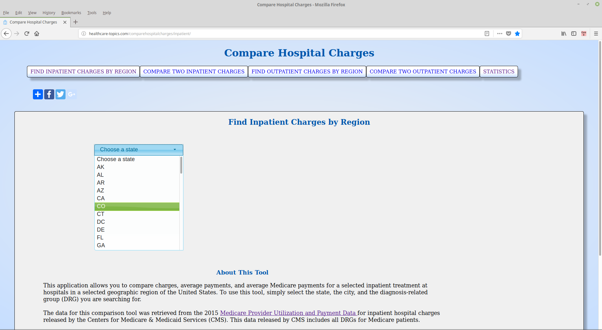
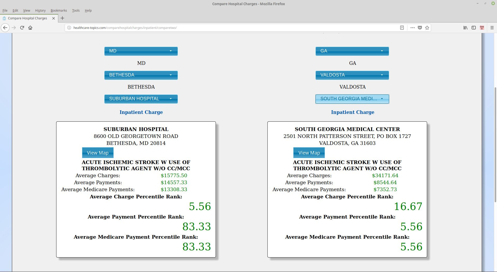
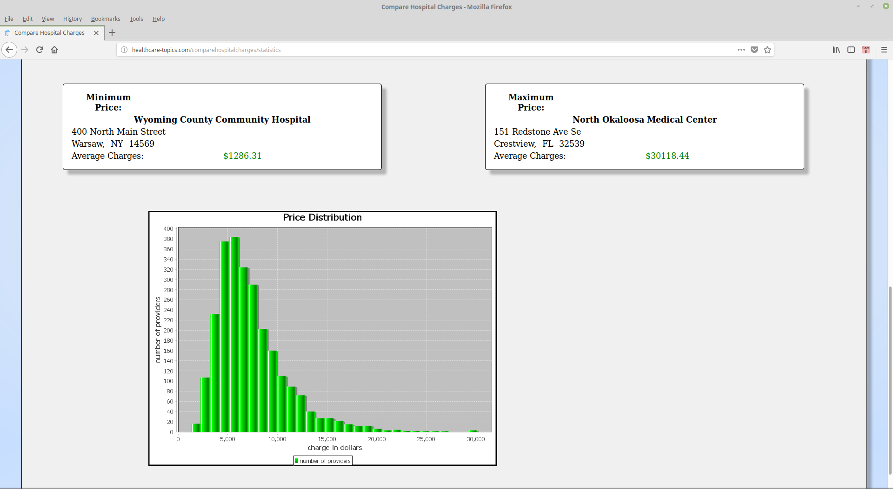

# hospital-charges-maven
This project is derived from the ant-based hospital-charges project. The source code can be used to build a web site for comparing inpatient and outpatient hospital charges in the United States based on the Centers for Medicare &amp; Medicaid Services (CMS) 2015 <a target="_blank" href="https://www.cms.gov/Research-Statistics-Data-and-Systems/Statistics-Trends-and-Reports/Medicare-Provider-Charge-Data/Inpatient.html">Medicare Provider Utilization and Payment Data </a>.

<figure>
  
  <figcaption>Figure 1. Inpatient Charges</figcaption>
</figure> 
 
<figure>
  
  <figcaption>Figure 2. Compare Two Charges</figcaption>
</figure> 
 
<figure>
  
  <figcaption>Figure 3. Price Statistics</figcaption>
</figure> 
 

## Hospital Charges Setup and Run Instructions

The website is built from the NetBeans IDE and runs on Tomcat. The following classpath dependencies are located in the Tomcat lib directory.

		-annotations-api.jar:
		-catalina-ant.jar:
		-catalina-ha.jar:
		-catalina-storeconfig.jar:
		-catalina-tribes.jar:
		-catalina.jar:
		-commons-lang3-3.4.jar:
		-ecj-4.5.jar:
		-el-api.jar:
		-jasper-el.jar:
		-jasper.jar:
		-javax.faces-2.2.20.jar:
		-javax.servlet.jsp.jstl-1.2.1.jar:
		-javax.servlet.jsp.jstl-api-1.2.1.jar:
		-jcommon-1.0.23.jar:
		-jfreechart-1.0.19.jar:
		-jsp-api.jar:
		-mysql-connector-java-5.1.49-bin.jar:
		-servlet-api.jar:
		-tomcat-api.jar:
		-tomcat-coyote.jar:
		-tomcat-dbcp.jar:
		-tomcat-i18n-es.jar:
		-tomcat-i18n-fr.jar:
		-tomcat-i18n-ja.jar:
		-tomcat-jdbc.jar:
		-tomcat-jni.jar:
		-tomcat-util-scan.jar:
		-tomcat-util.jar:
		-tomcat-websocket.jar:
		-websocket-api.jar

The application reads from 2 MySQL databases, one for inpatient data and the other for outpatient data. Run the creation scripts for each followed by the populator scripts to insert all necessary data.

